# 任務管理應用程式 - 使用者流程圖

## 1. 首次使用流程

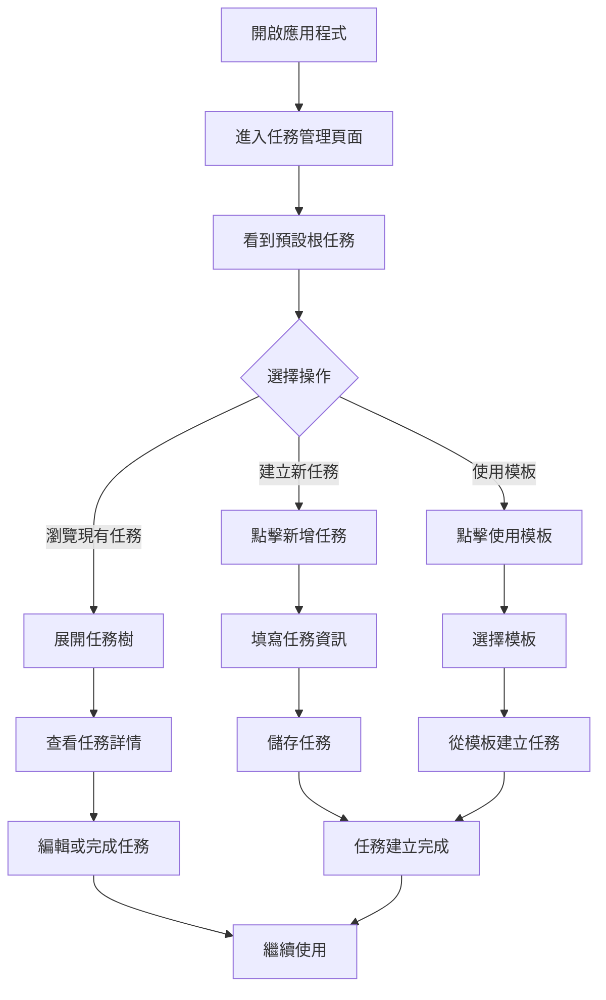

## 2. 建立新任務流程

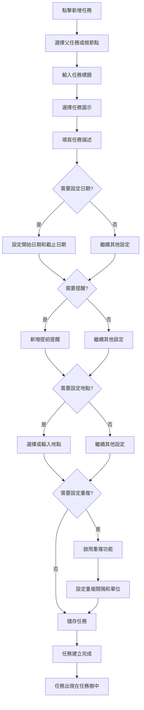

## 3. 使用模板建立專案流程

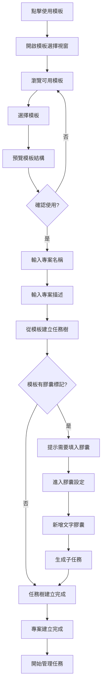

## 4. 管理重複任務流程

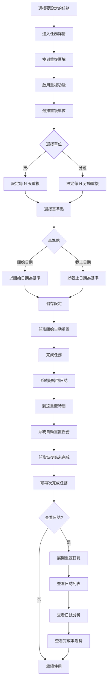

## 5. 使用文字膠囊生成任務流程

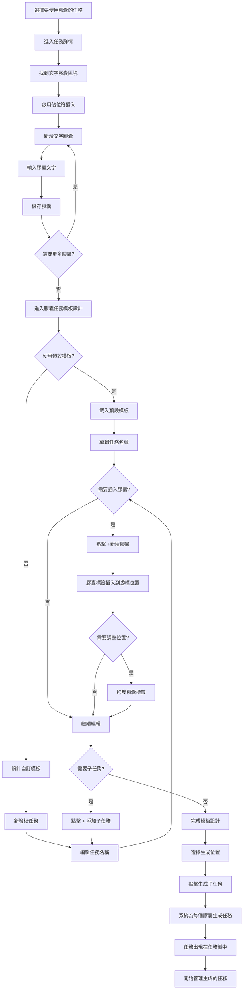

## 6. 編輯任務流程

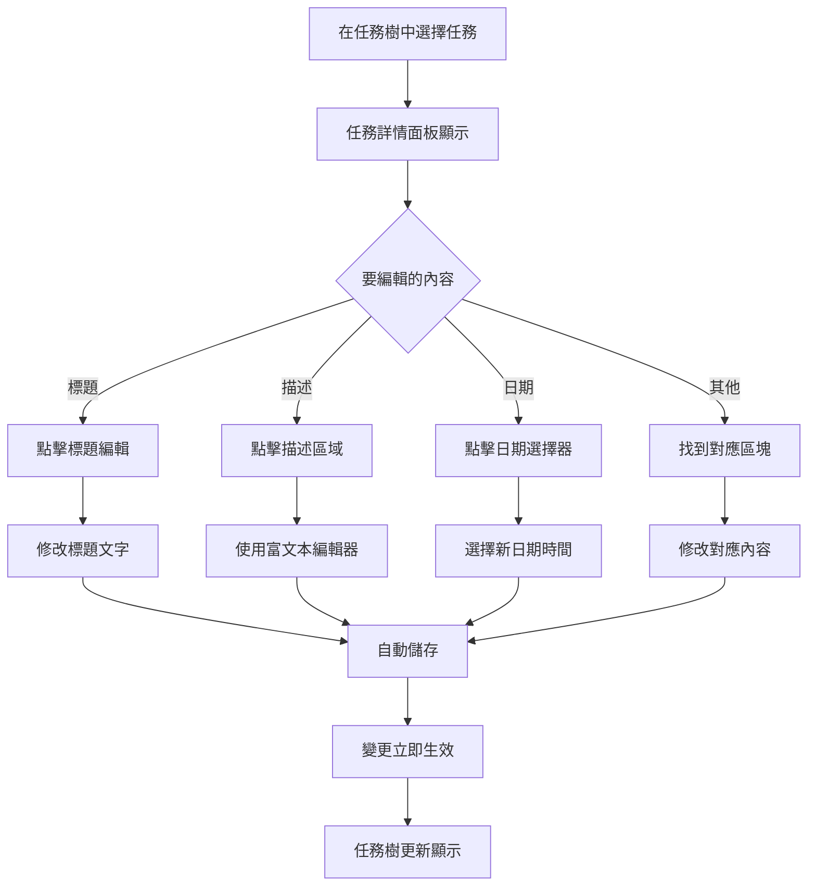

## 7. 完成任務流程

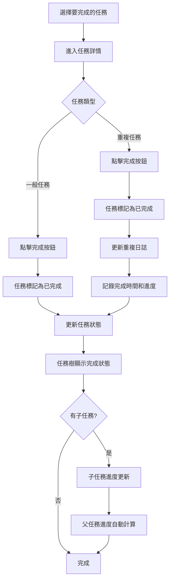

## 8. 查看任務視圖流程

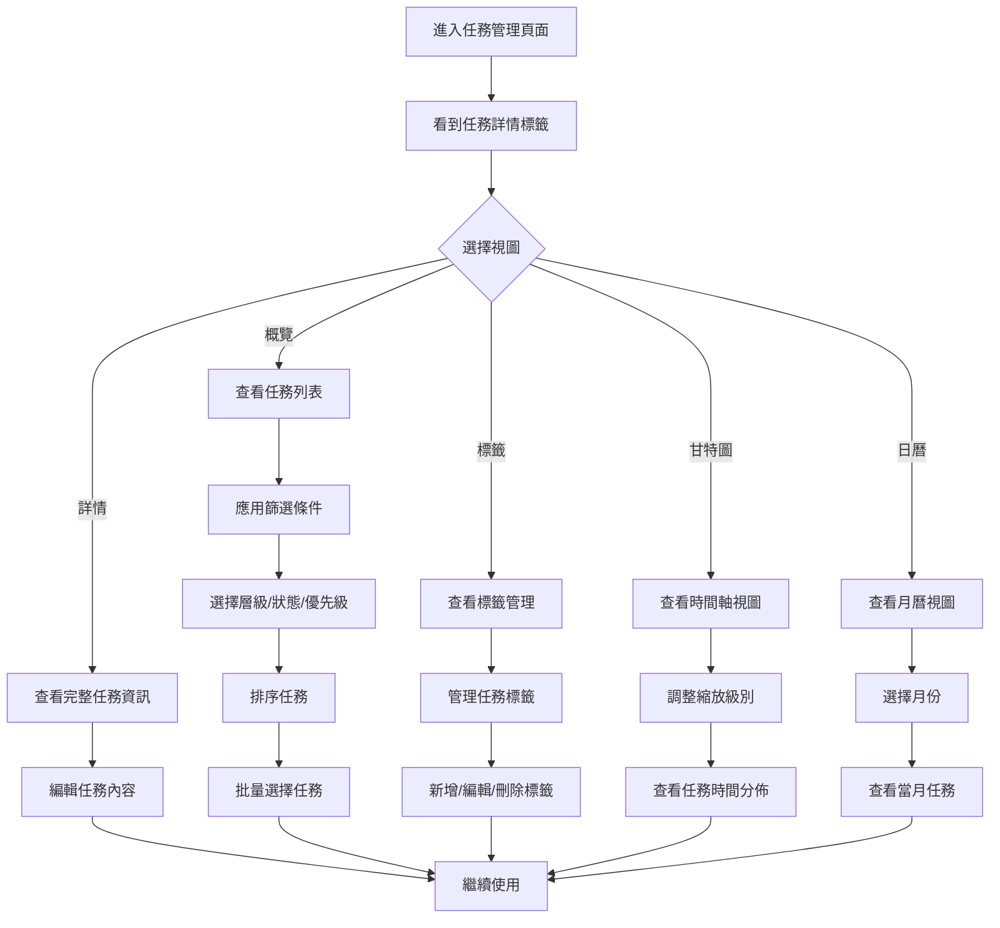

## 9. 管理任務樹結構流程

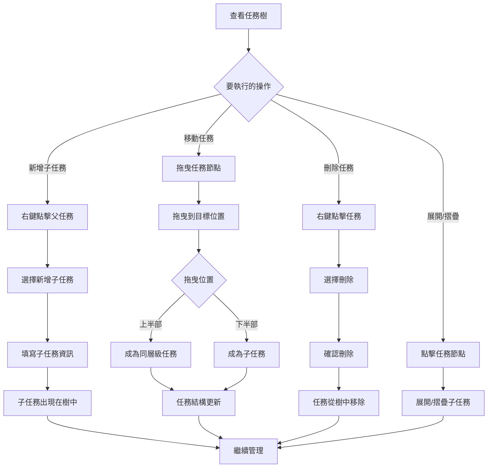

## 10. 設定提醒流程

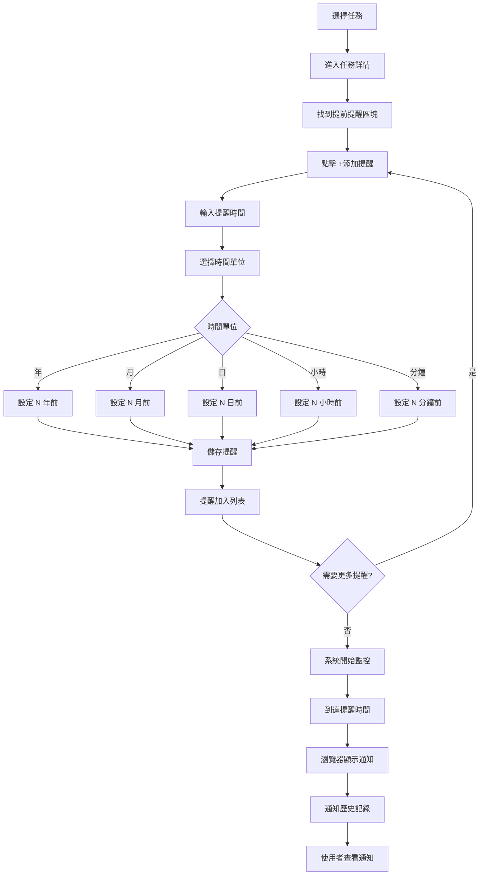

## 11. 使用甘特圖管理任務流程

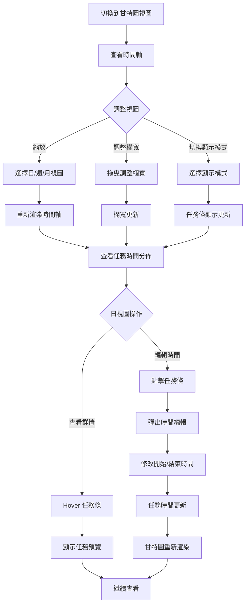

## 12. 使用日曆視圖流程

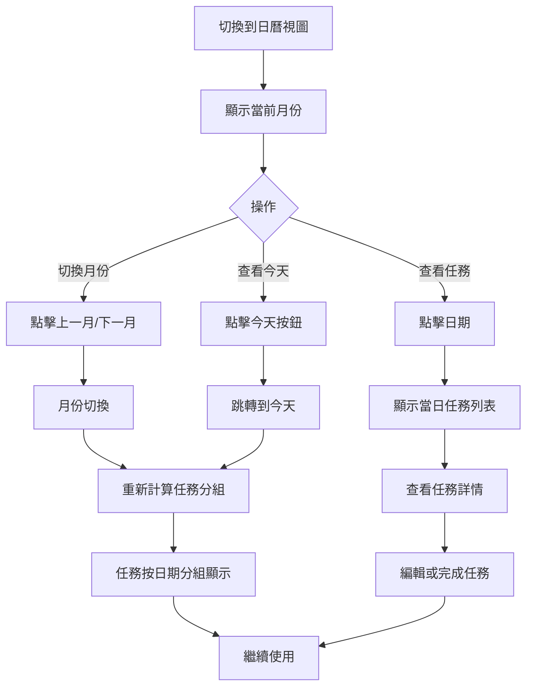

## 13. 標籤管理流程

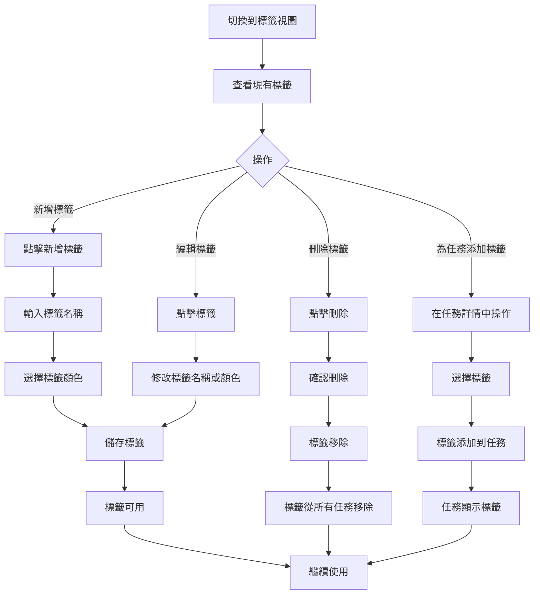

## 14. 完整任務管理週期流程

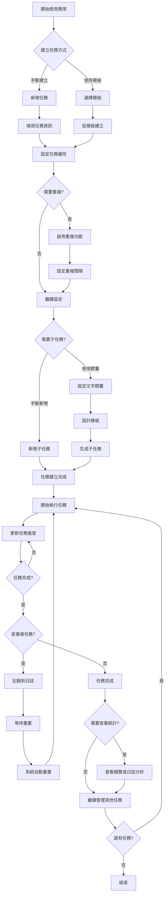

## 15. 任務搜尋與篩選流程

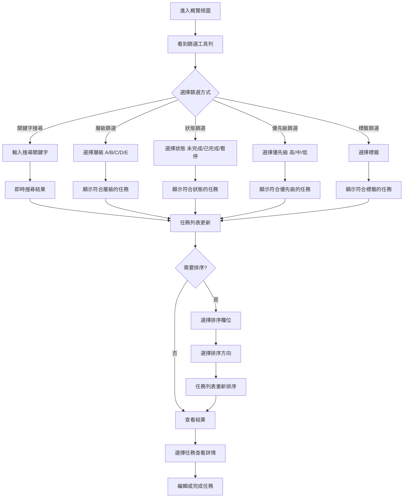

---

## 使用說明

這些流程圖使用 **Mermaid** 語法編寫，可以直接在 GitHub 上使用。

### 在 GitHub 中使用：

1. 建立或編輯 `.md` 文件
2. 複製任何一個流程圖的程式碼（從 `\`\`\`mermaid` 到 `\`\`\``）
3. 貼上到你的 Markdown 文件中
4. GitHub 會自動渲染成流程圖

### 範例：

```markdown
## 首次使用流程

\```mermaid
flowchart TD
    A[開啟應用程式] --> B[進入任務管理頁面]
    ...
\```
```

**注意**：在實際使用時，反斜線 `\` 不需要，這裡只是為了顯示語法。

### 流程圖說明：

- **矩形**：一般操作步驟
- **菱形**：決策點（需要使用者選擇）
- **箭頭**：流程方向
- **文字**：操作描述

這些流程圖從使用者的角度展示了應用程式的各種使用場景，可以幫助使用者理解如何使用這個任務管理系統。


