# 任務管理應用程式 - 流程圖

## 1. 應用程式啟動流程

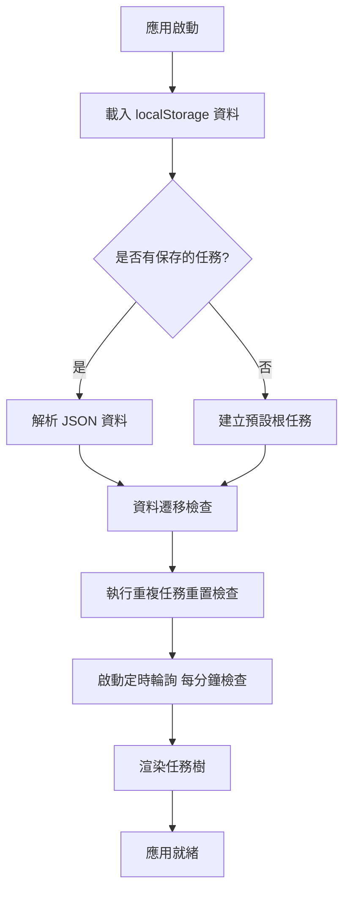

## 2. 重複任務重置流程

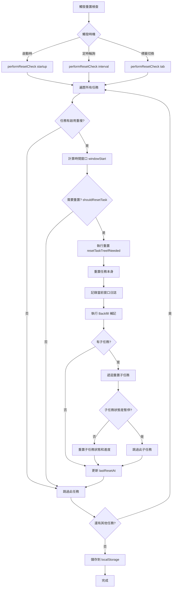

## 3. 膠囊任務生成流程

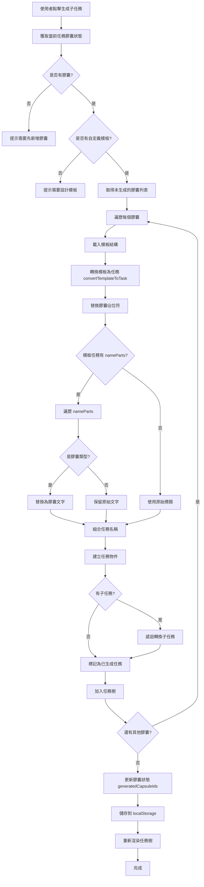

## 4. 任務新增/編輯流程

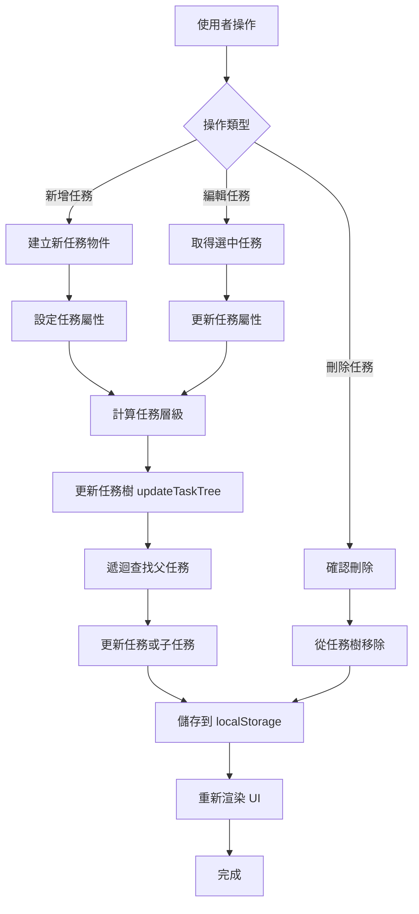

## 5. 膠囊模板設計流程

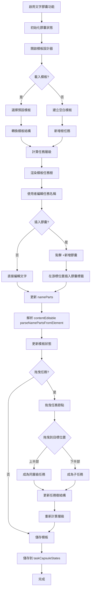

## 6. 任務視圖切換流程

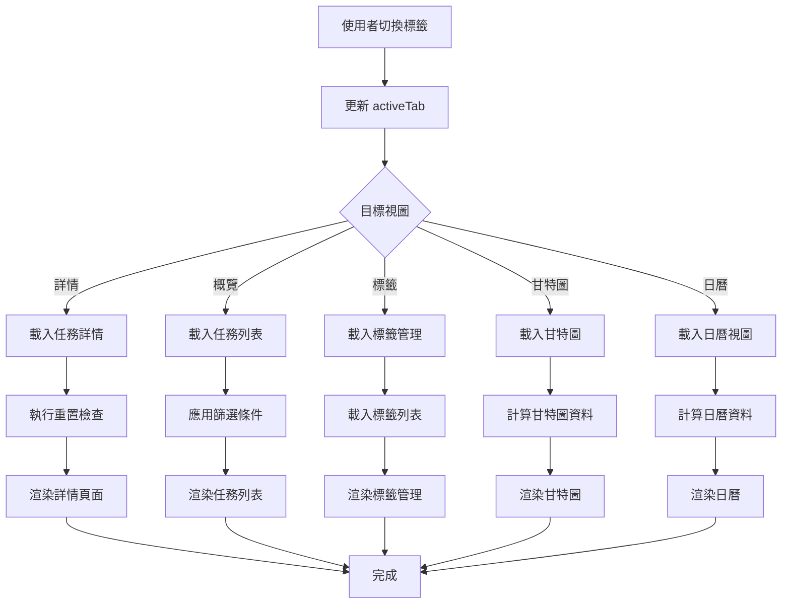

## 7. 重複日誌更新流程

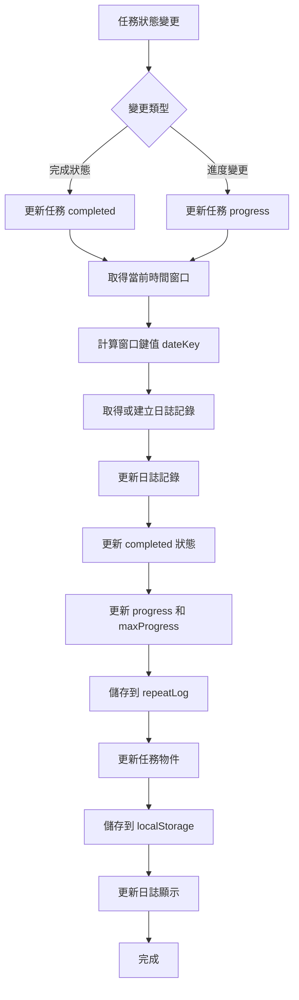

## 8. 膠囊拖曳流程（在任務名稱中）

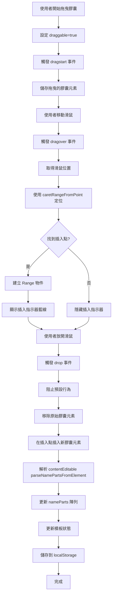

## 9. 任務拖曳重組流程

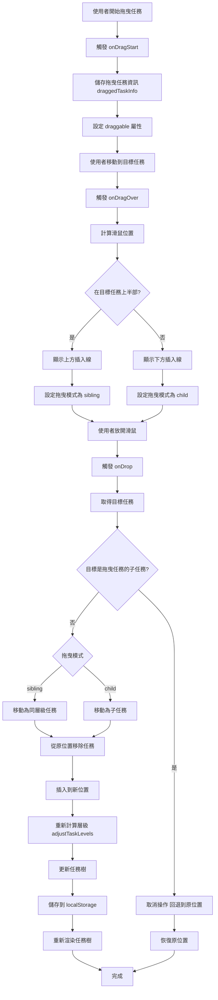

## 10. 資料持久化流程

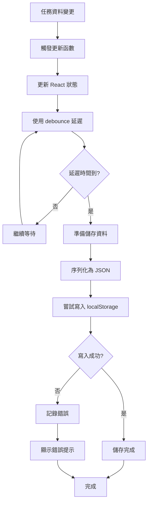

## 11. 通知系統流程

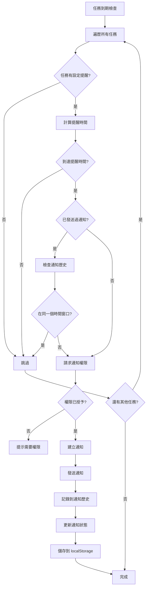

## 12. 模板載入流程

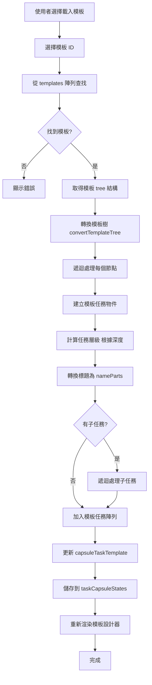

---

## 使用說明

這些流程圖使用 **Mermaid** 語法編寫，可以直接在以下平台使用：

1. **GitHub**：在 Markdown 文件中直接貼上，GitHub 會自動渲染
2. **GitLab**：同樣支援 Mermaid
3. **其他平台**：需要 Mermaid 支援的編輯器或網站

### 在 GitHub 中使用：

1. 建立或編輯 `.md` 文件
2. 貼上上述任何一個流程圖的程式碼
3. GitHub 會自動渲染成流程圖

### 範例：

```markdown
## 應用程式啟動流程

\```mermaid
flowchart TD
    A[應用啟動] --> B[載入 localStorage 資料]
    ...
\```
```

注意：在實際使用時，反斜線 `\` 不需要，這裡只是為了顯示語法。


